# Design Pattern

对高级软件设计课程的内容做一个总结，包括9种常用设计模式的实现

## 1、适配器模式

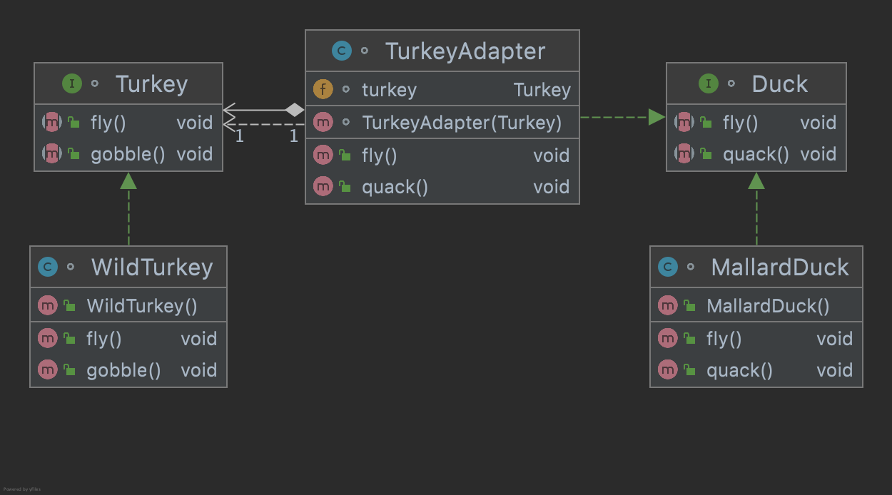

TurkeyAdapter类包含了一个实现了Turkey接口的类的对象并且自身实现了Duck接口。

在使用时，通过TurkeyAdapter的构造函数来为turkey对象赋值，TurkeyAdapter并且可以作为Duck的对象来使用。

**适配器模式**是一种结构型设计模式， 它能使接口不兼容的对象能够相互合作。

## 2、命令模式

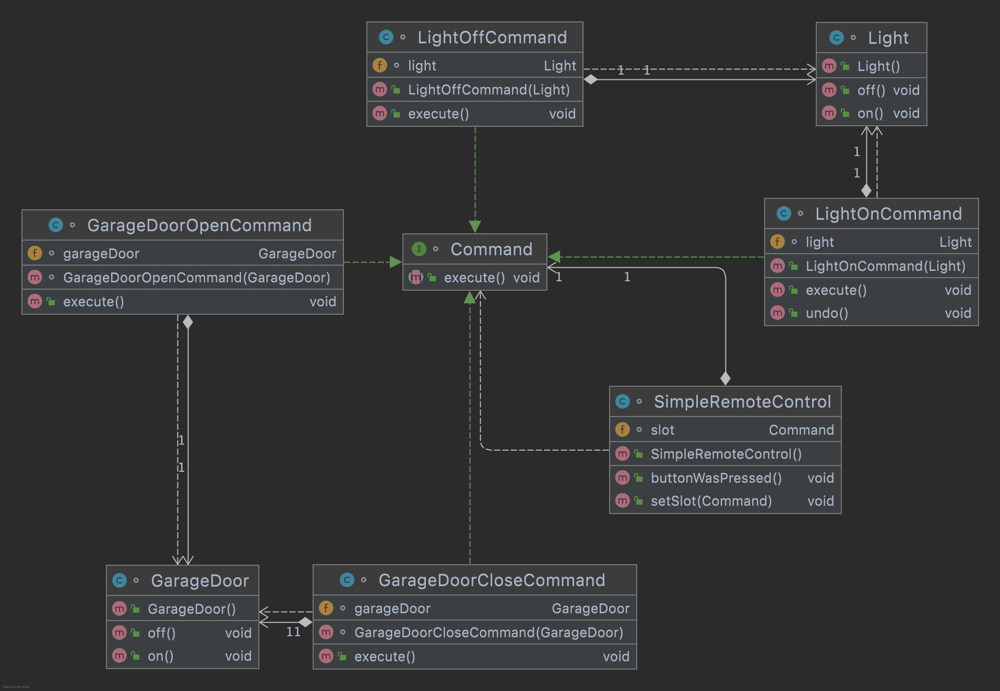

GarageDoor/Light Receiver 接收者知道如何进行必要的工作

Command Command 为所有命令生命了一个接口，调用命令对象的execute()方法，就可以让接收者进行相关的动作。

SimpleRemoteControl Invoker 调用者持有一个命令对象，并在某个时间点执行命令对象的execute()方法

LightOnCommand/GarageDoorOpenCommand ContreteCommand 定义了动作和接受者之间的绑定关系。

Client负责创建一个ConcreteCommand对象并指定其接收者，这里未画出

## 3、装饰器模式

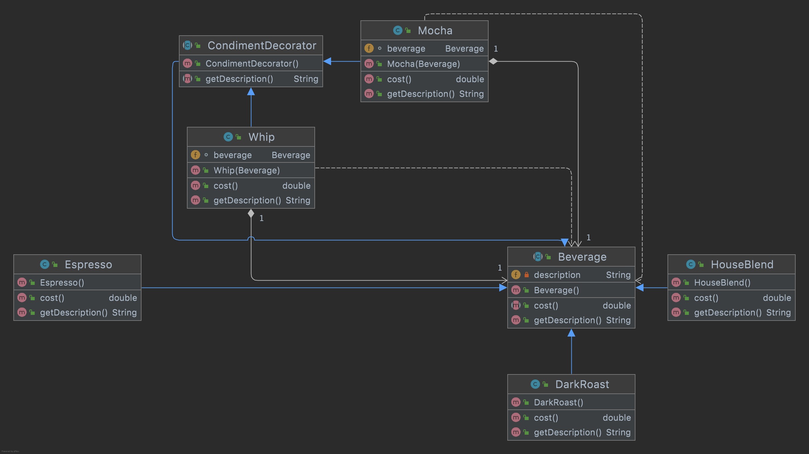

Espresso/HouseBlend/DarkRoast代表三种饮料，这三种饮料都实现了Beverage抽象类，现在有一个需求是这三种饮料中可以添加Mocha或者Whip之后会计算新的价格。

这时候考虑使用Whip和Mocha类来对Beverage进行装饰，Whip和Mocha也继承自一个抽象的装饰类，这个类中可以定义一些共有的装饰的方法，如本例中的getDescription()，最主要的是这个抽象类也继承自Beverage类，也就是说被装饰完之后的对象还是一个Beverage 类型的对象。装饰类要含有一个Beverage的被装饰对象，通过构造具体装饰类的构造函数为这个被装饰对象赋值。

装饰器模式的一个经典的应用就是Java的IO，这里也有对应的实现。

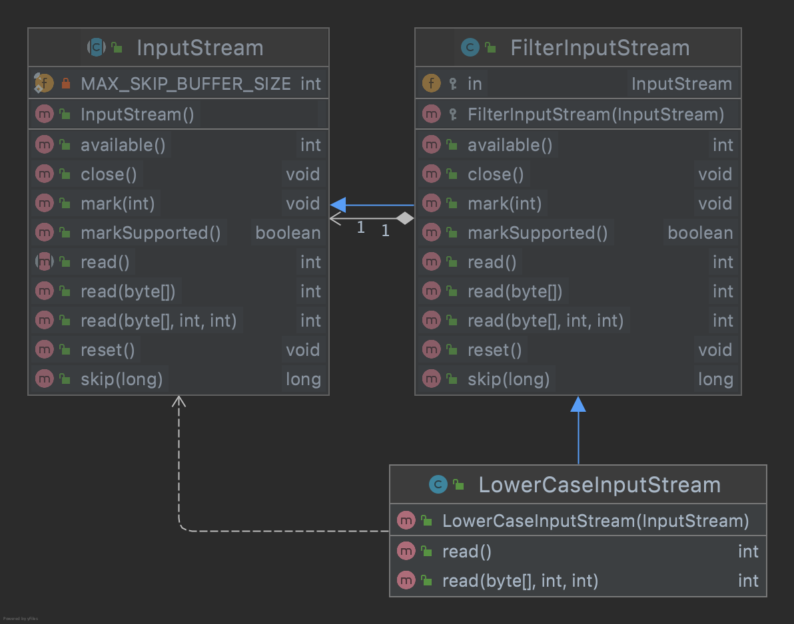

## 4、工厂方法

### 简单工厂方法

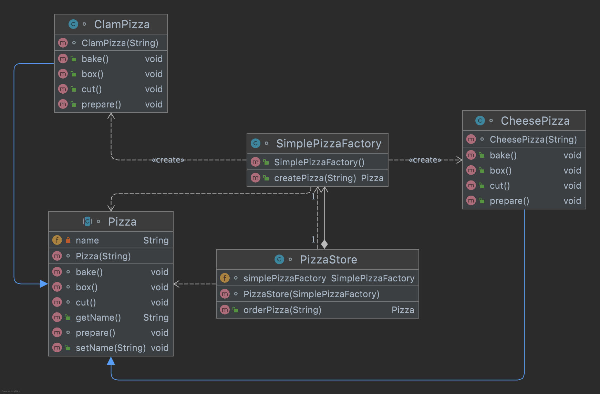

封装变化，将对象的创建过程放在SimplePizzaFactory中进行

### 工厂方法

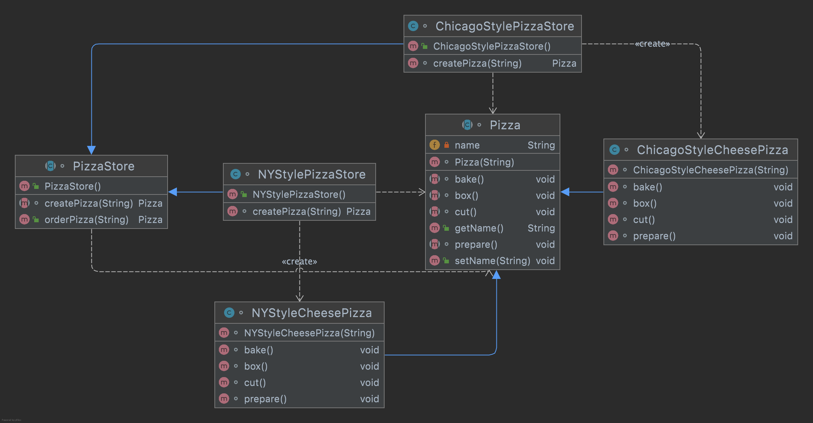

在PizzaStore中的createPizza方法，这是一个抽象方法可以到子类来实现，由子类来决定具体要创建的类型。

### 抽象工厂方法

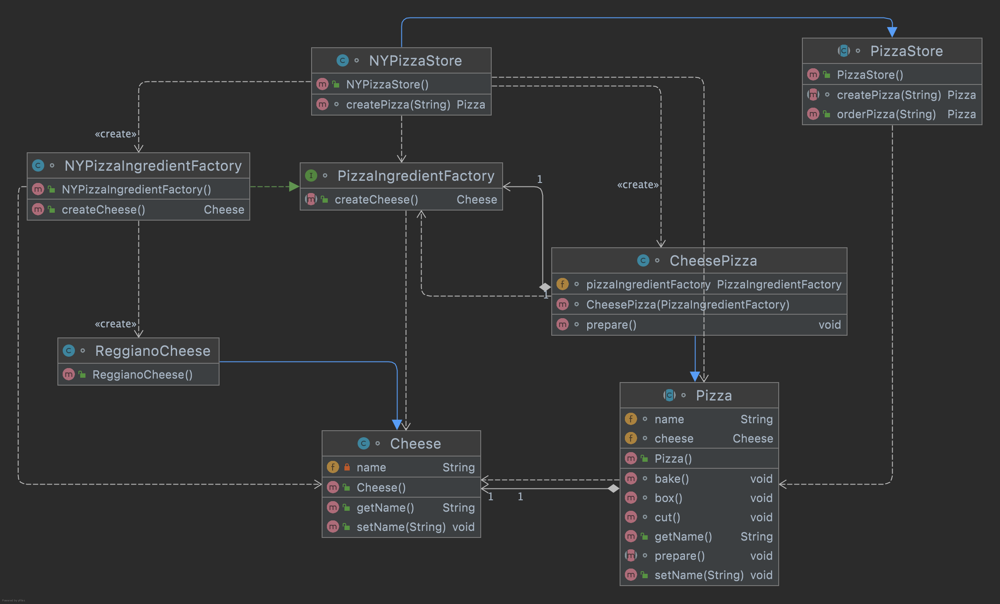

抽象工厂方法：提供一个创建一系列相关或相互依赖对象的接口，而无需指定它们具体的类。

抽象工厂模式（Abstract Factory）是一个比较复杂的创建型模式。在这个例子中抽象工厂是PizzaStore。

## 5、观察者模式

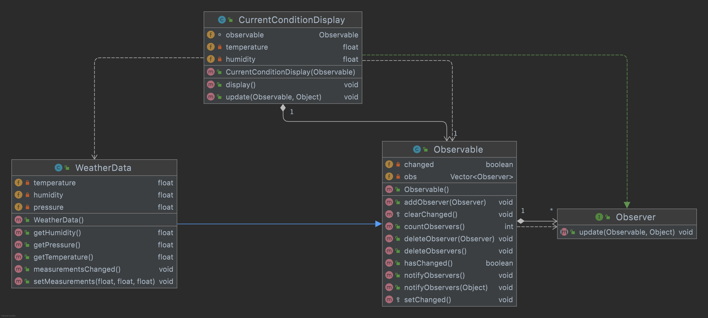

Java提供了对于观察者模式的支持，观察者实现Observer接口，被观察者实现Observable接口。

## 6、单例模式

三种实现的方式：懒汉式、饿汉式、双重检验锁

## 7、状态模式

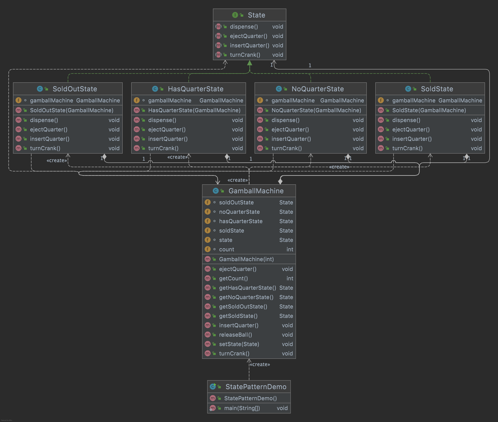

## 8、策略模式

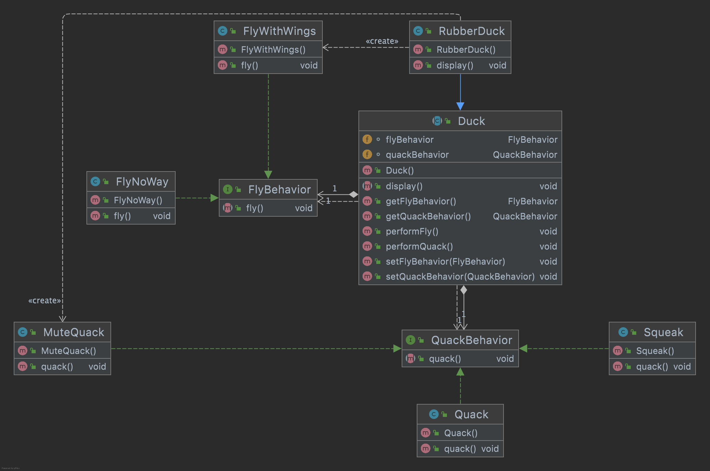

将行为作为属性包含在Duck类中，用户可以使用Duck的setFlyBehavior（）方法来实现对Fly策略的选择。

## 9、模版方法

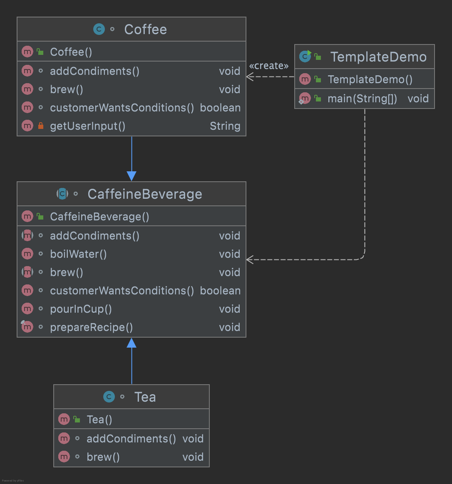

这里的prepareRecipe()是一个模版方法，抽象类中定义了一些对于Tea和Coffee一致的操作比如说boilWater()和PourInCup()，但是又有一些不一样的方法，这时候可以把这些不一样的方法定义为抽象方法留到子类来定义个性化的操作。需要注意这里的一个customerWantsConditions函数这个函数是子类可以不实现也可以通过覆写来重写定义新的功能，在模版方法中这个函数被称为hook函数，
